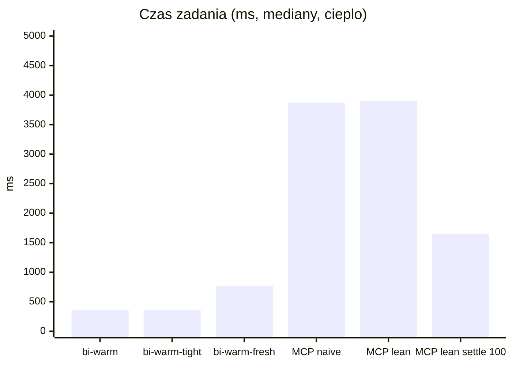
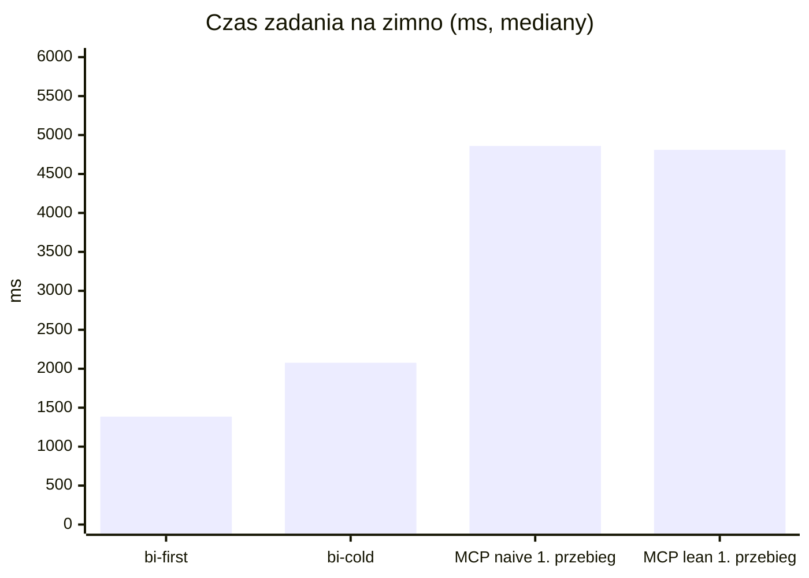
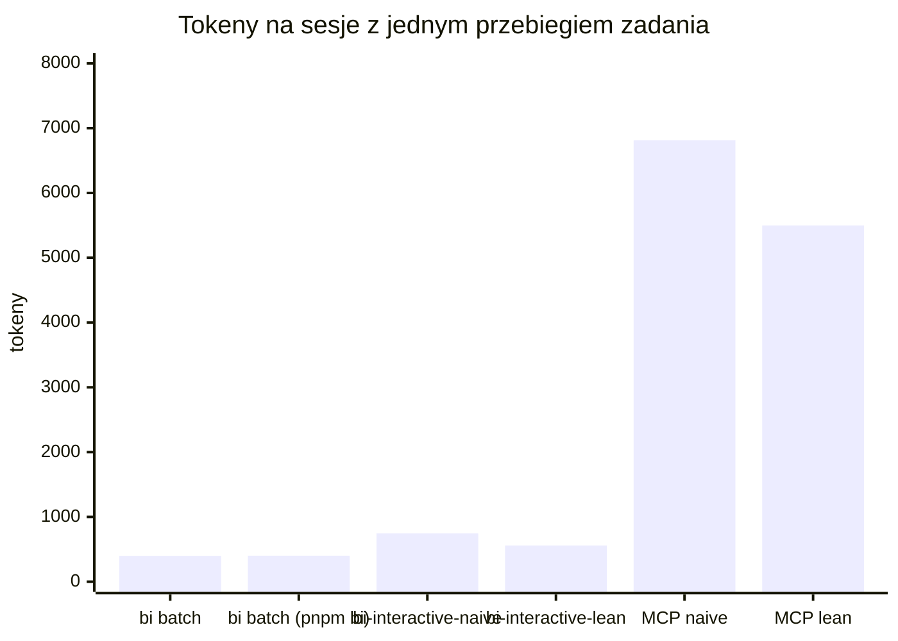

# RAPORT.md — bi (browser-inspector 2) vs @playwright/mcp: czas i tokeny

To samo zadanie QA na tym samym formularzu (`bench/task.mjs`, 18 kroków), wykonane przez `bi` w każdym wariancie z
DESIGN.md §9 i przez serwer MCP Playwrighta w trzech wariantach, zmierzone dwiema miarami: **ile czasu** od `spawn` do
`exit` prawdziwego procesu klienta i **ile tokenów** wchodzi do okna kontekstu agenta. Raport generuje `npm run bench` —
każda liczba niżej pochodzi z przebiegu, żadna nie jest wpisana ręcznie.

Środowisko: 2026-09-02T02:10:21.641Z · 11th Gen Intel(R) Core(TM) i7-11850H @ 2.50GHz (16 rdzeni, 32 GB) · win32 10.0.26200 · Node 26.5.0 · bi 0.1.0 · playwright-core 1.62.1 · Chrome/152 · @playwright/mcp 0.0.80 (24 narzędzi w `tools/list`).
Powtórzenia: cold/first ×3, warm n=10 po obu stronach, przerwa 300 ms po obu stronach.

## Tabela nagłówkowa

| wariant | mediana | p90 | n · tryb | × vs MCP naive | × vs MCP lean | × vs MCP lean `--timeout-settle 100` |
| --- | ---: | ---: | --- | ---: | ---: | ---: |
| bi-warm | **358 ms** | 366 ms | 10 · `warm` | **10,8×** | **10,9×** | **4,6×** |
| bi-warm-tight | **355 ms** | 370 ms | 10 · `warm` | **10,9×** | **11,0×** | **4,6×** |
| bi-first | **1385 ms** | 1395 ms | 3 · `first` | **3,5×** (vs 1. przebieg) | **3,5×** (vs 1. przebieg) | **1,4×** (vs 1. przebieg) |
| bi-cold | **2077 ms** | 2145 ms | 3 · `no-daemon` | **2,3×** (vs 1. przebieg) | **2,3×** (vs 1. przebieg) | **0,9×** (vs 1. przebieg) |
| bi-warm-fresh | **765 ms** | 789 ms | 10 · `warm` | **5,1×** | **5,1×** | **2,2×** |
| bi-first, first-ever (pierwsze w tym przebiegu benchu, n=1, poza ilorazami) | 1408 ms | — | 1 · `first` | — | — | — |
| MCP naive (agent poznaje ekran) | 3871 ms (warm) | 3969 ms | 10 · 1. przebieg 4860 ms | — | — | — |
| MCP lean (agent zna selektory) | 3898 ms (warm) | 4461 ms | 10 · 1. przebieg 4810 ms | — | — | — |
| MCP lean `--timeout-settle 100` | 1648 ms (warm) | 1727 ms | 10 · 1. przebieg 1911 ms | — | — | — |

**Wniosek z tabeli:** ścieżka ciepła `bi-warm` (mediana 358 ms, p90 366 ms) jest **10,8× vs domyślne** ustawienia MCP (naive warm 3871 ms), 10,9× vs MCP lean i **~4,6× vs zestrojony settle 100** (1648 ms) — dwie trzecie różnicy to domyślna polityka `--timeout-settle 500` serwera po każdej akcji, nie architektura. 5× jest własnością **każdego wywołania po pierwszym**; `bi-first` (1385 ms) i `bi-cold` (2077 ms) to fizyka startu Chrome i są raportowane osobno, poza progiem 5×.





## Tokeny (o200k)

Dwie kolumny, bo mieszanie ich zaciera obraz. **Stały** płaci się w KAŻDEJ sesji, zanim padnie pierwsze pytanie: po stronie
MCP definicje narzędzi z `tools/list` (+ `initialize`), po stronie `bi` blok instrukcji w AGENTS.md. **Zmienny** płaci się za
wykonanie zadania: po stronie MCP argumenty i tekst odpowiedzi każdego wywołania, po stronie `bi` komendy, stdout i
przeczytany w całości `report.md` (batch) albo same linie stdout (sesja — zrzuty to pliki, których agent nie czyta).

| wariant | stały | zmienny | razem na sesję |
| --- | ---: | ---: | ---: |
| **bi batch** — `bi read.config.json`, stdout, cały `report.md` | 146 | 254 | **400** |
| bi batch przez `pnpm bi` (skrypt pakietu) | 146 | 256 | **402** |
| **bi-interactive-naive** — gołe `bi snap`, potem refy (17 komend) | 146 | 599 | **745** |
| **bi-interactive-lean** — `bi find` + selektory (17 komend) | 146 | 412 | **558** |
| MCP Playwright — agent poznaje ekran | 4069 | 2745 | **6814** |
| MCP Playwright — agent zna selektory | 4069 | 1430 | **5499** |



Batch `bi` kosztuje **400** tokenów na sesję wobec 6814 (MCP naive) i 5499 (MCP lean) — **17,0×** / 13,7× mniej. Sam koszt stały: 146 vs 4069.

### Gdzie idą tokeny (najdroższe pozycje kosztu zmiennego)

**bi batch**

| pozycja | tokeny |
| --- | ---: |
| report.md w całości | 223 |
| stdout przebiegu | 27 |
| komenda agenta (bi read.config.json) | 4 |

**bi batch (pnpm bi)**

| pozycja | tokeny |
| --- | ---: |
| report.md w całości | 223 |
| stdout przebiegu | 27 |
| komenda agenta (pnpm bi read.config.json) | 6 |

**bi-interactive-naive**

| pozycja | tokeny |
| --- | ---: |
| ← snap stdout | 223 |
| ← console stdout | 64 |
| → bi form "e10=Jan Kowalski" e12=jan.kowalski@example.com "e24=Formularz nie zapisuje zgloszenia po kliknieciu Wyslij." | 43 |
| ← open stdout | 33 |
| ← shot stdout | 26 |

**bi-interactive-lean**

| pozycja | tokeny |
| --- | ---: |
| ← console stdout | 64 |
| → bi form "#name=Jan Kowalski" #email=jan.kowalski@example.com "#description=Formularz nie zapisuje zgloszenia po kliknieciu Wyslij." | 41 |
| ← open stdout | 33 |
| ← shot stdout | 26 |
| ← shot stdout | 25 |

**mcp-naive**

| pozycja | tokeny |
| --- | ---: |
| ← browser_snapshot (odpowiedź) | 579 |
| ← browser_snapshot (odpowiedź) | 492 |
| ← browser_snapshot (odpowiedź) | 315 |
| ← browser_click (odpowiedź) | 126 |
| ← browser_click (odpowiedź) | 124 |

**mcp-lean**

| pozycja | tokeny |
| --- | ---: |
| → browser_fill_form (argumenty) | 195 |
| ← browser_fill_form (odpowiedź) | 131 |
| ← browser_click (odpowiedź) | 127 |
| ← browser_click (odpowiedź) | 125 |
| ← browser_console_messages (odpowiedź) | 118 |

## Sesja interaktywna (`bi-interactive`)

Każda komenda to osobny proces `node bin/bi.mjs` przez keepera (czas = spawn → exit). Dwa warianty: `naive` (agent patrzy
gołym `bi snap` i działa na refach) i `lean` (agent zna selektory, `bi find` tylko dla przycisku). Oba oglądają stan po
pierwszym kliku (`bi snap --diff`).

| wariant | komend | czas całej sesji | komenda: mediana / p90 | tokeny | bramka |
| --- | ---: | ---: | ---: | ---: | --- |
| bi-interactive-naive | 17 | 2499 ms | 117 / 164 ms | 745 | ok |
| bi-interactive-lean | 17 | 2349 ms | 108 / 146 ms | 558 | ok |

<details><summary>bi-interactive-naive — komendy i stdout</summary>

```
$ bi open http://localhost:4300/   # 575 ms, exit 0
ok open "Zgłoszenie serwisowe" · el 12 · err 0 · .scribe/browser-inspector/session/bench-naive/snap.md
$ bi snap   # 127 ms, exit 0
h1 "Zgłoszenie serwisowe"
e6 link "Na górę" → #top [data-testid=nav-top]
e7 link "Formularz" → #form [data-testid=nav-form]
e10 textbox "Imię i nazwisko" [data-testid=field-name]
e12 textbox "E-mail" [data-testid=field-email]
e14 combobox "Kategoria" [data-testid=field-category]
option "Awaria" [selected]
option "Pytanie"
option "Wniosek o zmianę"
e18 radio "Niski" [data-testid=priority-niski]
e20 radio "Normalny" [checked] [data-testid=priority-normalny]
e22 radio "Krytyczny" [data-testid=priority-krytyczny]
e24 textbox "Opis" [data-testid=field-description]
e26 checkbox "Zgadzam się na przetwarzanie danych" [data-testid=field-consent]
e28 button "Wyślij zgłoszenie" [data-testid=submit]
$ bi click e28   # 164 ms, exit 0
ok click e28 · dom Δ
$ bi snap --diff   # 112 ms, exit 0
0 changed · .scribe/browser-inspector/session/bench-naive/snap.md
$ bi get [data-testid=error-email]   # 100 ms, exit 0
Podaj poprawny adres e-mail.
$ bi shot walidacja   # 117 ms, exit 0
ok shot .scribe/browser-inspector/session/bench-naive/shots/001-walidacja.png 1280x720
$ bi form "e10=Jan Kowalski" e12=jan.kowalski@example.com "e24=Formularz nie zapisuje zgloszenia po kliknieciu Wyslij."   # 138 ms, exit 0
ok form 3 fields · dom Δ
$ bi select e14 zmiana   # 111 ms, exit 0
ok select e14 = zmiana
$ bi click e22   # 138 ms, exit 0
ok click e22 · dom Δ
$ bi click e26   # 136 ms, exit 0
ok click e26 · dom Δ
$ bi click e28   # 142 ms, exit 0
ok click e28 · dom Δ
$ bi wait --sel [data-testid=confirmation]   # 118 ms, exit 0
ok wait [data-testid=confirmation]
$ bi get [data-testid=ticket-id]   # 104 ms, exit 0
ALM-1001
$ bi get [data-testid=ticket-category]   # 108 ms, exit 0
zmiana
$ bi get [data-testid=ticket-priority]   # 104 ms, exit 0
krytyczny
$ bi console --errors   # 94 ms, exit 0
2 new:
error Failed to load resource: the server responded with a status of 404 (Not Found) (http://localhost:4300/api/zgloszenia:0)
error [zgloszenia] zapis nie powiodl sie: HTTP 404 (http://localhost:4300/:125)
$ bi shot potwierdzenie   # 108 ms, exit 0
ok shot .scribe/browser-inspector/session/bench-naive/shots/002-potwierdzenie.png 1280x720
```

</details>

<details><summary>bi-interactive-lean — komendy i stdout</summary>

```
$ bi open http://localhost:4300/   # 528 ms, exit 0
ok open "Zgłoszenie serwisowe" · el 12 · err 0 · .scribe/browser-inspector/session/bench-lean/snap.md
$ bi find Wyślij   # 120 ms, exit 0
e28 button "Wyślij zgłoszenie" [data-testid=submit]
$ bi click e28   # 146 ms, exit 0
ok click e28 · dom Δ
$ bi snap --diff   # 103 ms, exit 0
0 changed · .scribe/browser-inspector/session/bench-lean/snap.md
$ bi get [data-testid=error-email]   # 100 ms, exit 0
Podaj poprawny adres e-mail.
$ bi shot walidacja   # 108 ms, exit 0
ok shot .scribe/browser-inspector/session/bench-lean/shots/001-walidacja.png 1280x720
$ bi form "#name=Jan Kowalski" #email=jan.kowalski@example.com "#description=Formularz nie zapisuje zgloszenia po kliknieciu Wyslij."   # 121 ms, exit 0
ok form 3 fields · dom Δ
$ bi select #category zmiana   # 104 ms, exit 0
ok select #category = zmiana
$ bi click [data-testid=priority-krytyczny]   # 123 ms, exit 0
ok click [data-testid=priority-krytyczny] · dom Δ
$ bi click #consent   # 129 ms, exit 0
ok click #consent · dom Δ
$ bi click e28   # 138 ms, exit 0
ok click e28 · dom Δ
$ bi wait --sel [data-testid=confirmation]   # 108 ms, exit 0
ok wait [data-testid=confirmation]
$ bi get [data-testid=ticket-id]   # 108 ms, exit 0
ALM-1001
$ bi get [data-testid=ticket-category]   # 101 ms, exit 0
zmiana
$ bi get [data-testid=ticket-priority]   # 99 ms, exit 0
krytyczny
$ bi console --errors   # 101 ms, exit 0
2 new:
error Failed to load resource: the server responded with a status of 404 (Not Found) (http://localhost:4300/api/zgloszenia:0)
error [zgloszenia] zapis nie powiodl sie: HTTP 404 (http://localhost:4300/:125)
$ bi shot potwierdzenie   # 109 ms, exit 0
ok shot .scribe/browser-inspector/session/bench-lean/shots/002-potwierdzenie.png 1280x720
```

</details>

## keeper-survives-shell

`bi up` w podprocesie powłoki, wyjście powłoki, `bi status` z nowego procesu: czy keeper przeżył? Jeśli host zabija drzewo
(Job Object), każde wywołanie agenta jest zimne i 5× dostaje tylko bench.

| powłoka | przeżył | `bi up` w powłoce | `bi status` po wyjściu | uwaga |
| --- | --- | ---: | ---: | --- |
| cmd | **yes** | 590 ms | 107 ms |  |
| bash | **yes** | 609 ms | 106 ms |  |
| pwsh | **yes** | 828 ms | 105 ms |  |

## app-factory (6 snapshotów, buildy na 4311–4314)

Config: `D:\github\app-factory\read.config.browser-inspector.json` (kopia z własnym `outputDir`; wariant „settled” = `networkidle` → `settled`, kroki `wait ms` bez zmian).

| config | parallel | przebiegi (ms) | completed | tryb |
| --- | ---: | --- | ---: | --- |
| bez zmian | 1 | 14 044 · 10 183 | 6/6 | warm, warm |
| bez zmian | 3 | 5743 · 4803 | 6/6 | warm, warm |
| po migracji `settled` | 1 | 9989 · 8970 | 6/6 | warm, warm |
| po migracji `settled` | 3 | 4726 · 4265 | 6/6 | warm, warm |

## Parytet z @playwright/mcp (macierz DESIGN.md §7)

Wierszy macierzy: 27 — ✅ 23 · ⚠️ 1 · ❌ 2. Serwer 0.0.80 w domyślnej konfiguracji ogłasza 24 narzędzi w `tools/list` (macierz liczy 70 z opcjonalnymi); każde ✅ ma test smoke albo jednostkowy (AC-15).

| narzędzie MCP | status |
| --- | --- |
| run_code_unsafe | ⚠️ tylko sesja, jawnie RCE-równoważne |
| install | ❌ celowo: systemowy Chrome/Edge |
| resume, annotate, video_chapter, video_show/hide_actions | ❌ celowo: `page.pause()` i kosmetyka nagrań headed |

## Bramka poprawności

Każdy wariant wyciągnął komplet faktów: numer zgłoszenia, kategoria, priorytet, komunikat walidacji, błąd z konsoli i dwa
zrzuty (`checkFindings` w `bench/task.mjs`). Porównanie opisuje więc różne drogi do **tego samego** wyniku.

## Metodyka i zasady uczciwości (DESIGN.md §9)

1. **Ten sam tokenizer po obu stronach** (`o200k_base` — proxy; wiarygodny jest stosunek, nie liczba absolutna).
2. **Liczone jest to, co wchodzi do kontekstu**: dla `bi` blok AGENTS.md jako koszt stały + komenda + stdout + `report.md` w
   całości (batch) / same linie stdout (sesja); dla MCP `tools/list` + `initialize` jako koszt stały + argumenty i tekst
   odpowiedzi każdego wywołania (jawne `browser_snapshot`, bo 0.0.80 linkuje snapshot w pliku, a agent i tak musi go zobaczyć).
3. **Czas od `spawn` do `exit` prawdziwego procesu klienta** (`node bin/bi.mjs …`), nigdy import w procesie benchu; po stronie
   MCP czas zadania na serwerze podniesionym raz (1. przebieg n=1 osobno, kolejne z medianą).
4. **Przerwa 300 ms między powtórzeniami po obu stronach** — scrub `bi` i `about:blank` MCP są poza stoperem tylko wtedy;
   `bi-warm-tight` pokazuje, co się dzieje bez przerwy.
5. **`timing.mode` każdego przebiegu jest walidowany**: przebieg z trybem innym niż oczekiwany w kolumnie (np. `first` w warm)
   jest wypisany pogrubieniem w tabeli nagłówkowej i unieważnia pomiar tej kolumny.
6. **`bi-cold` czeka na zniknięcie pid klienta i potomnych `chrome.exe`** przed następnym powtórzeniem; `bi-first` zatrzymuje
   keepera (`bi stop`) i czeka tak samo. „first-ever” (pierwsze wywołanie w przebiegu benchu) jest osobno, poza ilorazami.
7. **Ta sama strona dla obu stron**: statyczna kopia formularza (`bench/app/`, `bench/serve.mjs`, bez nagłówków cache, bez
   dev-servera), `/api/zgloszenia` zawsze 404 — awaria widoczna wyłącznie w konsoli i sieci.
8. Wersje i sprzęt w nagłówku; każdy iloraz liczy się wobec pomiaru MCP 0.0.80 z tego samego dnia i tej samej maszyny.

Pełne rozbicie tokenów co do pozycji: [WYNIKI.md](WYNIKI.md). Fazy przebiegu wobec budżetu DESIGN.md §6: [BUDGET.md](BUDGET.md).
Surowe dane: `bench/out/results.json` (nie w repo).
