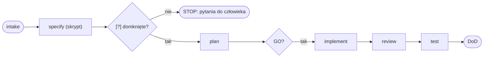

# Diagramy Mermaid w dokumentacji

Użyj, gdy piszesz albo recenzujesz `.md` (ADR, README, `docs/sdd/`, raport review, spec). GitLab renderuje
bloki ```mermaid sam. VS Code po instalacji rozszerzenia z `.vscode/extensions.json`.

## Kiedy diagram

1. Diagram, gdy treść ma 3 lub więcej elementów i relacje między nimi. Dwa elementy i strzałka to zdanie.
2. Pod diagramem jedno zdanie: co czytelnik ma z niego wynieść.
3. Jeden diagram = jedna teza. Legenda dłuższa niż 5 pozycji = dwa diagramy.

## Typ do treści

| Treść                                    | Typ Mermaid                          |
| ---------------------------------------- | ------------------------------------ |
| przepływ, decyzje, drabina SDD           | `flowchart LR` / `flowchart TD`      |
| kto do kogo i w jakiej kolejności        | `sequenceDiagram`                    |
| stany i przejścia                        | `stateDiagram-v2`                    |
| zależności projektów / bibliotek         | `flowchart` z `subgraph` per zakres  |
| harmonogram                              | `gantt`                              |
| struktura danych, kontrakt               | `classDiagram` / `erDiagram`         |

## Reguły

1. Etykiety po polsku. Identyfikatory (agenci, pliki, komendy) po angielsku. Węzły bez spacji (`review_a`),
   etykiety w `["…"]`.
2. `LR` dla przepływów w czasie, `TD` dla hierarchii. Nie mieszasz w jednym dokumencie.
3. Bez kolorów i `style`. Wyróżnienie robi kształt węzła: `{}` decyzja, `([])` start i koniec, `[[ ]]` podproces.
4. Nazwy agentów, tierów i komend takie same jak w rosterze i `AGENTS.md`. Nazwy modeli tylko w rejestrze.
5. Pierwsza linia bloku to typ diagramu. Bez `%%{init}`. Najwyżej 25 węzłów.
6. Diagram opisujący kod ma pod spodem źródło prawdy (np. `tools/scripts/affected.mjs`). Zmienia się razem z kodem.

## Sprawdzenie przed commitem

Podgląd Markdownu w VS Code (`Markdown: Open Preview`). Blok, który się nie renderuje albo pokazuje co innego
niż tekst obok, to 🔴 w przeglądzie dokumentacji.

## Szkielet



Drabina SDD w jednym spojrzeniu. Źródło prawdy: `docs/sdd/methodology.md`.
