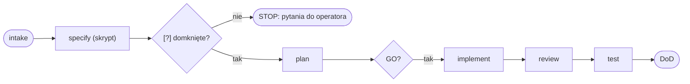

# Diagramy Mermaid w dokumentacji

Użyj, gdy piszesz albo recenzujesz `.md` (ADR, README, `docs/sdd/`, raport review, spec) i treść ma
kształt, którego zdanie nie niesie: przepływ, sekwencja wywołań, zależności, stany, harmonogram.
GitLab renderuje bloki ```mermaid natywnie; VS Code — po instalacji rozszerzenia podglądu
z `.vscode/extensions.json`.

## Kiedy diagram, a kiedy zdanie

- Diagram, gdy są co najmniej trzy elementy i relacje między nimi (drabina SDD, routing agentów,
  kierunek zależności bibliotek, sekwencja żądań). Dwa elementy i strzałka to zdanie.
- Diagram uzupełnia prozę, nie zastępuje: pod diagramem jedno zdanie, co czytelnik ma z niego wynieść.
- Jeden diagram = jedna teza. Diagram, który potrzebuje legendy dłuższej niż pięć pozycji, to dwa diagramy.

## Typ do treści

| treść                                    | typ Mermaid                         |
| ---------------------------------------- | ----------------------------------- |
| przepływ, decyzje, drabina SDD           | `flowchart LR` / `flowchart TD`     |
| kto do kogo i w jakiej kolejności        | `sequenceDiagram`                   |
| stany i przejścia (status zadania, spec) | `stateDiagram-v2`                   |
| zależności projektów / bibliotek         | `flowchart` z `subgraph` per zakres |
| harmonogram, kamienie milowe             | `gantt`                             |
| struktura danych, kontrakt               | `classDiagram` / `erDiagram`        |

## Reguły

1. Etykiety po polsku, identyfikatory (agenci, pliki, komendy) po angielsku — jak w prozie; węzły
   nazywaj identyfikatorami bez spacji (`review_a`), etykiety w `["…"]`.
2. Kierunek: `LR` dla przepływów w czasie, `TD` dla hierarchii; nie mieszaj w jednym dokumencie.
3. Bez kolorów i `style` — motyw renderera (GitLab, VS Code) decyduje; wyróżnienie robi kształt węzła
   (`{}` decyzja, `([])` start/koniec, `[[ ]]` podproces).
4. Nazwy agentów, tierów i komend w diagramie są takie same jak w rosterze i `AGENTS.md` — diagram
   podlega tym samym bramom prozy: nazwy modeli tylko w rejestrze, wersje tylko w bloku AUTOGEN.
5. Blok zaczyna się od typu diagramu w pierwszej linii; żadnych `%%{init}` z motywem; ≤ 25 węzłów —
   większy diagram to znak, że opisuje dwie rzeczy.
6. Diagram opisujący kod (routing, graf zależności, sekwencja skryptów) ma w zdaniu pod spodem źródło
   prawdy (`.github/agents/orchestrator.agent.md`, `tools/scripts/affected.mjs`); gdy kod się zmienia,
   diagram idzie za nim w tym samym MR — `doc-reviewer` sprawdza zgodność.

## Sprawdzenie przed commitem

Podgląd Markdownu w VS Code z rozszerzeniem Mermaid (`Markdown: Open Preview`); blok, który się nie
renderuje albo pokazuje co innego niż tekst obok, to 🔴 w przeglądzie dokumentacji.

## Szkielet



Drabina SDD w jednym spojrzeniu; źródło prawdy: `docs/sdd/methodology.md`.
