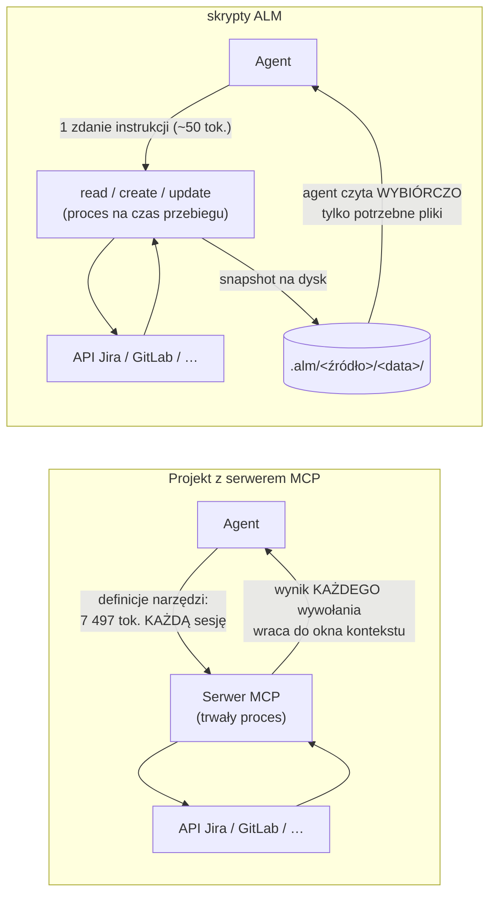
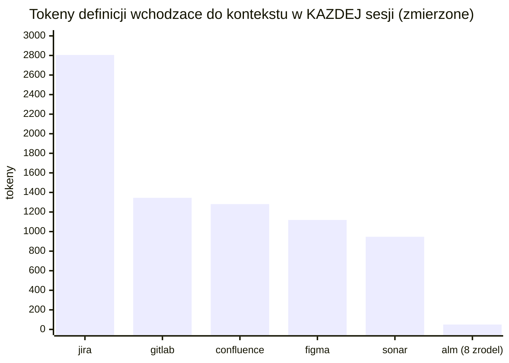
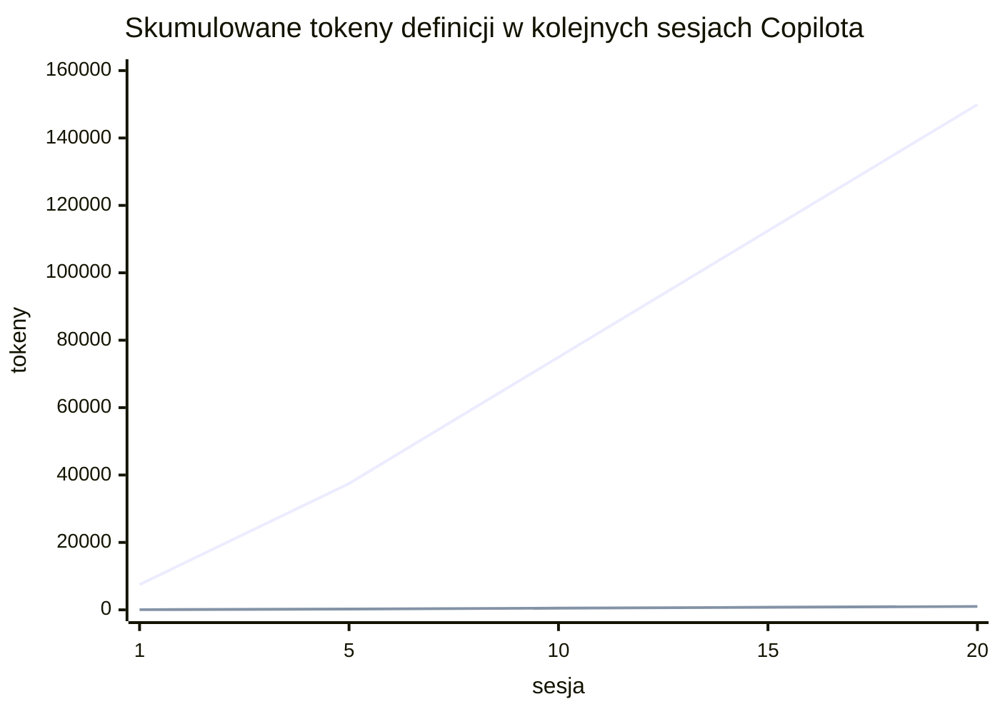

# MCP vs skrypty ALM — porównanie kosztów i architektury

Dwa sposoby dania agentowi (Copilot, Claude, dowolny inny) dostępu do tych samych danych:
**serwer MCP** wystawiający narzędzia przez protokół, albo **skrypty ALM** (`npm run alm:*`), które
piszą wynik na dysk. Oba kończą na tych samych API (Jira, GitLab, Confluence i reszta źródeł). Różnią się
tym, **kto płaci tokenami i kiedy**.

Liczby oznaczone „zmierzone" pochodzą z realnego `tools/list` serwerów, które w tym
repozytorium działały, zanim zostały usunięte (bajty po normalizacji, 4,0 B/token).
Scenariusze oznaczone „założenie" mają jawnie podane parametry — podstaw własne.

## Architektura — gdzie płyną dane

Dwie różnice, z których wynika cała reszta:

1. **Koszt stały.** Definicje narzędzi MCP wchodzą do okna kontekstu przy każdej sesji —
   niezależnie od tego, czy agent w ogóle dotknie Jiry. Skrypt kosztuje jedno zdanie
   w instrukcjach repozytorium.
2. **Koszt zmienny.** W MCP wynik każdego wywołania (pełny JSON zadania, strona, lista MR)
   przepływa przez kontekst agenta. W skryptach ALM wynik ląduje w plikach, a agent otwiera tylko
   te, których potrzebuje — grep po `.alm/` jest tańszy niż transport wszystkiego przez
   okno.

## Koszt definicji — zmierzone

| Serwer                        | Kształt      | Narzędzia | Tokeny definicji |
| ----------------------------- | ------------ | --------: | ---------------: |
| `jira`                        | tylko odczyt |        22 |            2 805 |
| `jira`                        | z zapisami   |        29 |            3 798 |
| `gitlab`                      | tylko odczyt |        13 |            1 345 |
| `confluence`                  | tylko odczyt |        12 |            1 281 |
| `figma`                       | tylko odczyt |        12 |            1 119 |
| `sonar`                       | tylko odczyt |         9 |              947 |
| **razem (5 read-only)**       |              |        68 |        **7 497** |
| **alm (8 źródeł + zapis)** | skrypty      |         0 |          **~50** |

Skala problemu przy małych oknach: limit kontekstu subagenta wynosił tu 3 000 tokenów —
sam serwer Jiry (read-only) zjadał **93,5%** tego okna, a w wariancie z zapisami
przekraczał je o 798 tokenów. Innymi słowy: subagent z podpiętym MCP Jiry nie miał już
miejsca na pracę.

## Copilot: ten projekt vs projekt z serwerem MCP

Scenariusz (założenie): zespół używa Copilot Chat w trybie agenta, **10 sesji dziennie**,
w projekcie podpięte odpowiedniki naszych pięciu serwerów (`.vscode/mcp.json`). Definicje
ładują się w każdej sesji.

- **MCP:** 10 × 7 497 = **74 970 tokenów dziennie** samych definicji — zanim padnie
  pierwsze pytanie. Miesięcznie (22 dni robocze) ≈ **1,65 mln tokenów**, płaconych także
  w sesjach, które Jiry nie dotykają.
- **alm:** jedno zdanie w `.github/copilot-instructions.md` („snapshoty robi
  `npm run alm:read -- <źródło>`, zapis `npm run alm:create`/`update -- <źródło> plik.md`, wyniki w `.alm/`") —
  ~50 tokenów na sesję, ≈ **11 tys. miesięcznie**. Redukcja warstwy definicji o **~99,3%**.

Koszt zmienny działa w tę samą stronę, choć zależy od danych: pobranie sprintu 50 zadań
przez MCP to 50+ wywołań, których **pełne odpowiedzi przechodzą przez kontekst**; w alm
to jeden `npm run alm:read -- jira`, po którym agent czyta `_manifest.json`, ewentualnie 3 pliki
`.md`, które go interesują — reszta leży na dysku i nie kosztuje nic. To ta sama
obserwacja, którą Anthropic opisał w
[Code execution with MCP](https://www.anthropic.com/engineering/code-execution-with-mcp):
duże wyniki pośrednie mają zostać w środowisku wykonania, nie w oknie modelu.

Do tego dochodzi to, czego wykresem nie widać:

- snapshot jest **trwały i współdzielony** — drugi agent (i człowiek) czyta te same pliki
  bez ponownych wywołań API; wynik MCP żyje tylko w kontekście jednej sesji,
- snapshoty są **diffowalne** (`--stamp` + `git diff`) i audytowalne (`X-Correlation-Id`
  w nagłówkach = `correlationId` w manifeście),
- zapis ma **dry-run z diffem i `--yes`** zamiast „narzędzie wykonało się od razu".

## Czego wykres nie mówi — kiedy MCP jest właściwe

Uczciwie, bo porównanie bez tej sekcji byłoby marketingiem:

- **żywa interaktywność** — „spójrz na stronę, potem zdecyduj, co kliknąć": to wymaga
  trwałego procesu; alm świadomie pokrywa tylko część batchowalną (flow + mapa
  elementów),
- **dynamiczne odkrywanie narzędzi** w trakcie sesji i **potwierdzenia per wywołanie**
  w UI klienta,
- **OAuth po stronie klienta** — MCP-owy klient umie przeprowadzić logowanie; alm
  zakłada token w profilu użytkownika,
- ekosystem: gotowe serwery MCP istnieją dla setek usług — skrypt trzeba napisać (tu:
  wzorzec ośmiu źródeł i ~jeden plik na nowe).

Reguła praktyczna z tego repozytorium: **to, co batchowalne, przez skrypty; to, co
naprawdę interaktywne, przez MCP** — i tylko wtedy podpinaj serwer do sesji, która go
faktycznie użyje.
